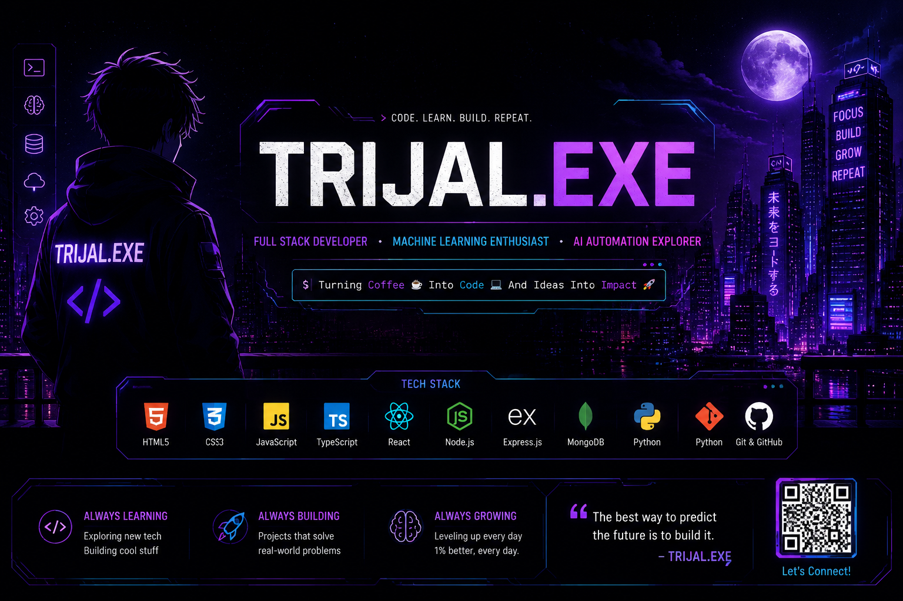

<p align="center">
  
</p>

<br>

<h1 align="center">⚡ Trijal Srivastav⚡</h1>
<h3 align="center">🚀 Software Developer | Java • DSA • Backend Development</h3>

<p align="center">

</p>

<p align="center">
  
</p>


<p>
<a href="https://github.com/TRIJAL28"></a>
<a href="https://www.linkedin.com/in/trijal-srivastav-987659332/"></a>
<a href="https://leetcode.com/u/trijal_srivastav/"></a>
</p>


</div>

---

## 🖥️ Developer Dashboard

```text
╔══════════════════════════════════════════════╗
          TRIJAL.SYS INITIALIZED
╠══════════════════════════════════════════════╣
 STATUS      : ONLINE 🟢
 ROLE        : Full Stack Developer
 FOCUS       : Machine Learning
 STACK       : MERN
 LANGUAGE    : Java | Python | JavaScript
 LEARNING    : AI • Automation • Backend
 GOAL        : Build products that matter.
╚══════════════════════════════════════════════╝
```

---

## ⚙️ Tech Arsenal

<p align="center">

</p>

---

## 📊 GitHub Analytics

<p align="center">


</p>

<p align="center">

</p>

---

## 🏆 Achievements

<p align="center">

</p>

---

## 📈 Contribution Graph

<p align="center">

</p>

---

## 🌱 Currently Learning

- Machine Learning
- Deep Learning Fundamentals
- n8n Automation
- Backend System Design
- Open Source Contributions

---

## 🌐 Let's Connect

<p align="center">
<a href="https://www.linkedin.com/in/trijal-srivastav-987659332/">

</a>
<a href="https://leetcode.com/u/trijal_srivastav/">

</a>
<a href="https://github.com/TRIJAL28">

</a>
</p>

---

## 🐍 Contribution Snake

<p align="center">
  
</p>

---

<div align="center">

### 💜 *"Consistency beats intensity. Build • Learn • Repeat."*

⭐ Thanks for visiting my profile!

</div>
